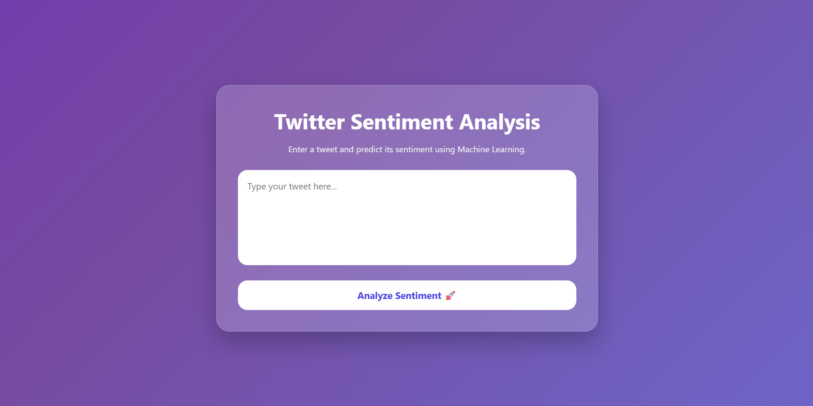
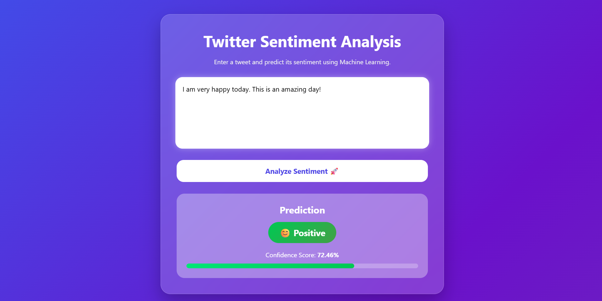
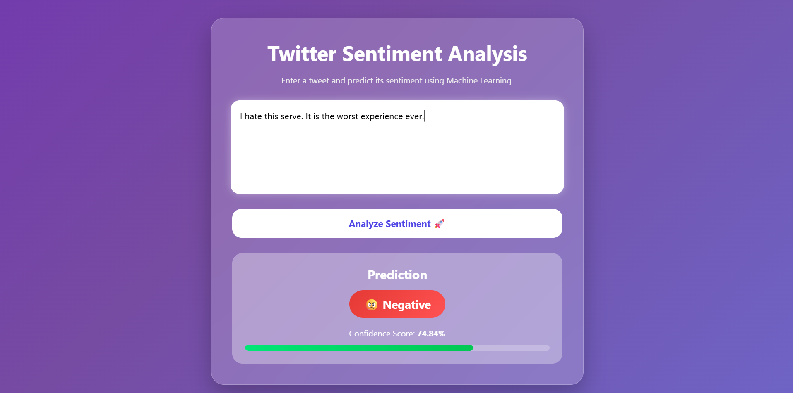
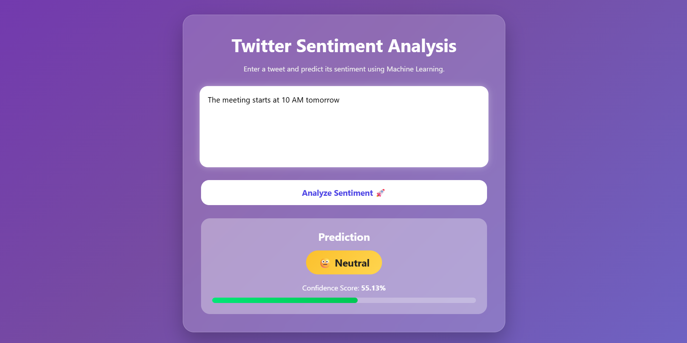

# Twitter Sentiment Analysis

A Machine Learning web application that predicts the sentiment of tweets as **Positive 😊, Negative 😠, or Neutral 😐** using **TF-IDF** and **Naive Bayes**.

---

## 📌 Project Overview

This project analyzes Twitter text using Natural Language Processing (NLP). Users can enter a tweet and instantly receive its predicted sentiment along with a confidence score through a Flask web interface.

---

## Live Demo

🔗 https://twitter-sentiment-analysis-0avc.onrender.com/

---

## ✨ Features

- Tweet Sentiment Prediction
- TF-IDF Text Vectorization
- Naive Bayes Classification
- Confidence Score
- Emoji-Based Prediction
- Responsive Glassmorphism UI

---

## 🛠 Tech Stack

- **Language:** Python
- **Frontend:** HTML, CSS
- **Backend:** Flask
- **Machine Learning:** Scikit-learn (TF-IDF, Naive Bayes)
- **Libraries:** Pandas, NLTK, Joblib

---

## ⚙ Installation Guide

```bash
git clone https://github.com/Bhagatkhushi/Twitter-Sentiment-Analysis.git
cd Twitter-Sentiment-Analysis

python -m venv venv

# Windows
venv\Scripts\activate

# Install Dependencies
pip install -r requirements.txt
```

---

## ▶ How to Run

Train the model:

```bash
python train_model.py
```

Run the Flask application:

```bash
python app.py
```

Open:

```
http://127.0.0.1:5000
```

---

## 📸 Screenshots

# Home Page


# Positive Prediction


# Negative Prediction


# Neutral Prediction


---

## 🔮 Future Enhancements

- Prediction History
- Dark Mode
- CSV File Analysis
- Deep Learning Models
- Cloud Deployment

---

## 👩‍💻 Author

**Khushi Bhagat**
